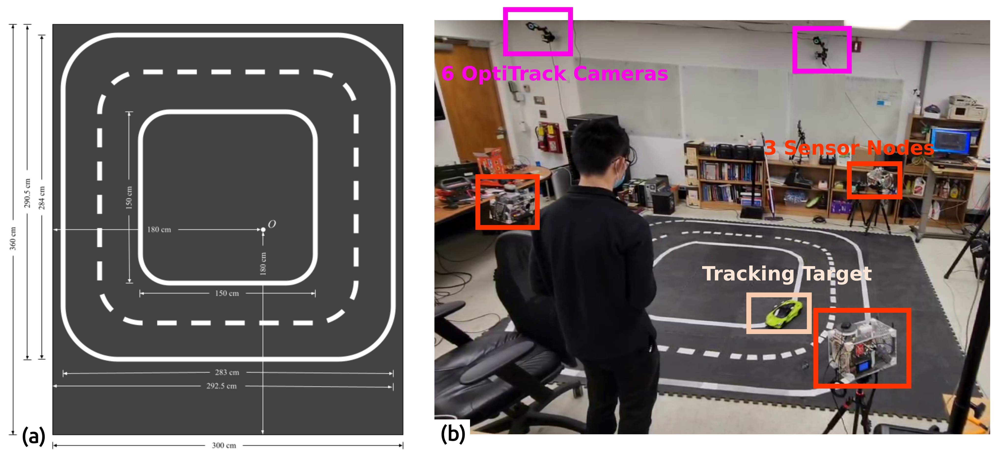
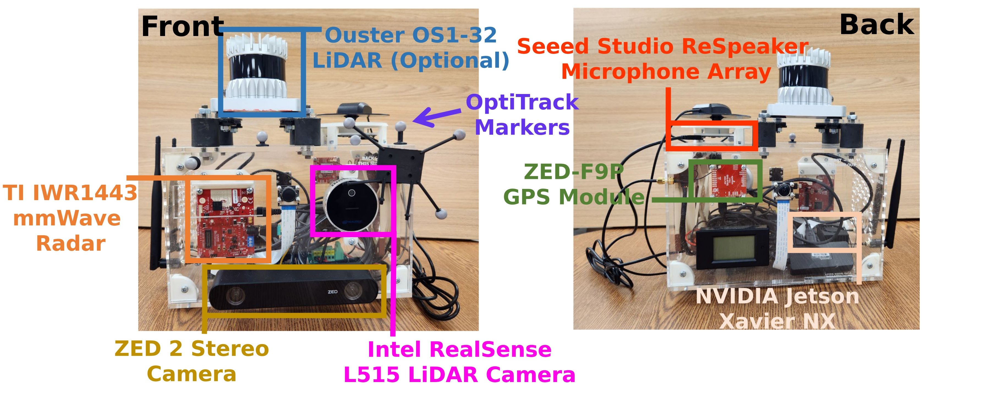
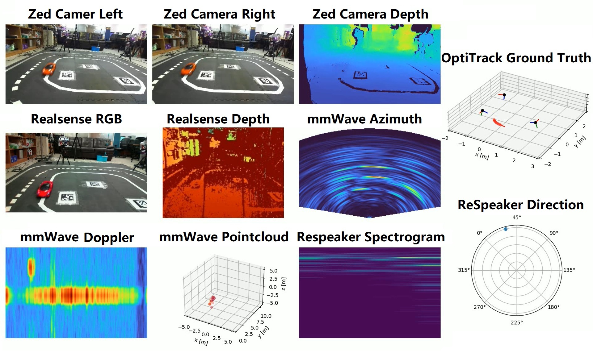
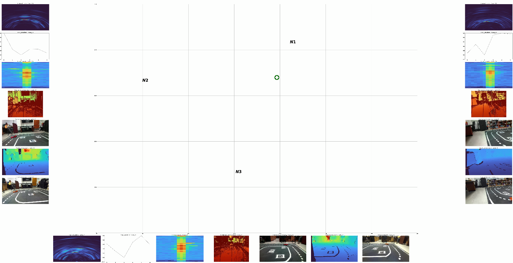

# GDTM
Dataset Repository

## Overview


### Abstract
One of the critical sensing tasks in indoor environments is geospatial tracking, i.e., constantly detecting and locating objects moving across a scene. Successful development of multimodal sensor fusion tracking algorithms relies on large multimodal datasets where common modalities exist and are time-aligned, and such datasets are not readily available. Moreover, some existing datasets either employs a single centralized sensor node or a set of sensors whose positions and orientations are fixed. Models developed on such datasets have difficulties generalizing to different sensor placements To fill these gaps, we propose GDTM, a nine-hour dataset for multimodal object tracking with distributed multimodal sensors and reconfigurable sensor node placements. This GDTM dataset enables the exploration of several research problems, including creating multimodal sensor fusion architectures robust to adverse sensing conditions and creating distributed object tracking systems robust to sensor placement variances.

### External Links 

-  **[Data]** We will be hosting the dataset on IEEE Dataport under a CC-BY-4.0 license for public access. The public dataset repository will be ready before cameraready, as it takes a lot of time to upload terabytes of data online. We hereby provide **a Google Drive link to part of the dataset available for the reviewers** before the terabyte full dataset is available online. This dataset includes two scenarios, low-light and good lighting, under single-view and all modality data collection. 

	https://drive.google.com/drive/folders/17RXrXc4Qd0yKhGVMyyZxVxF9NrwolRgn?usp=sharing


-  **[PDF]** PDF to the scientific paper on the dataset: (Link to be updated, paper under review).

-  To ensure the reproducibility of the results shown in this paper, we summarized the setup instructions, the link to pre-processed sample data, and the **code used to generate our results** in:

	https://github.com/nesl/GDTM-tracking

-  **[Video]** A **demo video** of our baseline results is available at

	https://youtu.be/Y-x_eEiFxaA


### Internal Links
[Further Information on the Raw Dataset](#Raw-Dataset)

[How to Pre-process GDTM Dataset](#Pre-processing-GDTM-Dataset)

[How to Load Pre-processed GDTM for Your Own Work](#How-to-Use-Pre-processed-GDTM)

## Raw Dataset

### Data Collection and Statistics
The experiments are conducted in an indoor setting on a race track that spans across an area of 3 m × 3.6 m. The race track is delineated with white tape on top of dark gray foam mats. Six OptiTrack cameras are set up around the room to collect ground truth. Three multimodal sensor nodes each containing a stereo vision camera, a LiDAR camera, a mmWave radar, and a microphone array are placed around the race track during each experiment. We drive remote-controlled cars on the racetrack in either a circular or a random pattern and collect synchronized multi-node multimodal sensor data to track the geospatial location of the remoted controlled (RC) cars.



Main hardware includes NVIDIA Jetson Xavier NX, TI IRW1443 mmWave Radar, Intel RealSense LiDAR camera, Zed 2 Stereo Vision Camera, and Seeed Studio ReSpeaker Microphone Array.
We created our custom tool for dataset collection using ROS, GStreamer, and individual sensor drivers from their manufacturers. Details available at:
https://dl.acm.org/doi/10.1145/3560905.3567770



The dataset covers three cases: one car, two cars, and one car in poor illumination conditions. One of the highlights of the GDTM (apart from being multi-node multimodal), is that the dataset covers varies sensor placement and orientations (i.e., viewpoints) under all three cases. GDTM thus helps resesarchers develop models that generalize to unseen sensor placements. Please refer to the paper for more details. A breakdown of GDTM is shown in the table below.


|                 | Good Lighting  Condition | Good Lighting  Condition | Good Lighting  Condition | Poor Lighting  Condition | Poor Lighting  Condition |
|:---------------:|:------------------------:|:------------------------:|:------------------------:|:------------------------:|:------------------------:|
|                 |          Red Car         |         Green Car        |         Two Cars         |          Red Car         |         Green Car        |
| # of Viewpoints |            16            |            17            |             7            |             9            |             4            |
|  Durations (minutes) |            150           |            140           |            80            |            140           |            40            |
|    Size (GB)    |            220           |            220           |            120           |            195           |            55            |

### Data Hierachy

The complete data set will be organized by first the experiment settings, then viewpoints. The top hierachies are shown below
```
─── GDTM/
    ├── One Car
    │   ├── View 1
    │   │   ├── data 1
    │   │   └── data 2
    │   ├── View 2
    │   │   ├── data 3
    │   │   ├── data 4
    │   │   └── data 5
    │   └── ...
    ├── Two Cars
    │   ├── View 1
    │   │   ├── data 40
    │   │   └── data 41
    │   ├── View 2
    │   └── ...
    └── Low Light
        ├── View 1
        │   ├── data 100
        │   └── data 101
        ├── View 3
        └── ...
```
Here each _dataN/_ folder indicates one experiment session, which lasts typically 5-15 minutes.

Inside _dataN/_ folder lay the data of that session, the hierachy is shown below
```
─── dataN/
    ├── node1/
    │   └── ...
    ├── node2/
    │   └── ...
    ├── node3/
    │   ├── IoBT_Node_13_gps_DATE_TIME.bag  # GPS info, not useful indoors
    │   ├── IoBT_Node_13_status_DATE_TIME.bag  # node health logs
    │   ├── IoBT_Node_13_DATE_TIME.bag  # Ouster LiDAR scans, we provide them in our raw datasets but have not used them in our paper
    │   ├── IoBT_Node_13_mmwave_DATE_TIME.bag
    │   ├── IoBT_Node_13_realsense_DATE_TIME.bag
    │   ├── IoBT_Node_13_realsense_depth_DATE_TIME.mp4
    │   ├── IoBT_Node_13_realsense_rgb_DATE_TIME.mp4
    │   ├── IoBT_Node_13_respeaker_DATE_TIME.bag
    │   ├── IoBT_Node_13_zed_DATE_TIME.bag
    │   └── IoBT_Node_13_zed_DATE_TIME.svo
    ├── optitrack.csv
    └── metadata.json  # to be explained in the next subsection
```
Here are the details of these files:

**LiDAR Camera** 

 - IoBT_Node_13_realsense_DATE_TIME.bag (Timestamps and Configurations)
 - IoBT_Node_13_realsense_depth_DATE_TIME.mp4 (Depth Stream)
 - IoBT_Node_13_realsense_rgb_DATE_TIME.mp4 (Camera Stream)

Intel RealSense L515 LiDAR cameras and Intel RealSense SDK are used to collect RGB and depth data. RGB frames are captured at 15 Hz with $1920 \times 1080$ resolution. Depth frames are streamed at 15 Hz with $640 \times 480$ resolution and a custom colormap. Both are stored in H264 encoding. Some vertical dark strips may be found in the LiDAR camera depth frames due to the infrared interference from the OptiTrack system. 

**Stereo Vision Camera**

 - IoBT_Node_13_zed_DATE_TIME.bag (Timestamps and Configurations)
 - IoBT_Node_13_zed_DATE_TIME.svo (Left/Right Camera and Computed Depth)

StereoLabs ZED 2i depth cameras and StereoLabs ZED SDK are used to provide supplmentary RGB and depth information. Both RGB and depth frames are captured at 15 Hz with $1920 \times 1080$ resolution. Both are stored in the proprietary [SVO format](https://support.stereolabs.com/hc/en-us/articles/360009986754-How-do-I-convert-SVO-files-to-AVI-or-image-depth-sequences-) and can be extracted with ZED SDK. A limitation of ZED cameras is that since depth is generated from RGB frames via stereo vision, they provide little utility in low-light conditions.

**mmWave Radar** (IoBT_Node_13_mmwave_DATE_TIME.bag)

TI mmWave IWR1443 radars are used to record radio frequency information. Range azimuth heatmap, range doppler heatmap, range profile, noise profile, and point cloud are recorded at 4 Hz and stored directly in the ROS bags. The configuration file is also stored in the ROS bags along with the data, as it is required to map the data to physical coordinates correctly.

**ReSpeaker** (IoBT_Node_13_respeaker_DATE_TIME.bag)

ReSpeaker microphone arrays are used to record audio data. ReSpeaker features 4 microphones placed $90^\circ$ from each other for direction of arrival (DOA) detection. The 6 audio channels ReSpeaker (raw data from the 4 microphones, merged playback, and processed audio for automatic speech recognition (ASR)) are encoded in FLAC format, converted to byte strings, and stored in ROS bags. The DOA is sampled at 15 Hz and also stored in the ROS bags.

**OptiTrack** (optitrack.csv)
An OptiTrack motion capture system is used to capture the ground truth location and orientations of the tracking subjects and the sensor nodes. It works by using a set if six infrared cameras to track reflective balls mounted on the target objects. In the .csv file, each entry is a timestamp (sampled at 120Hz), and seven numbers are used to represent the pose of one object: 3 numbers for position (x,y,z), and 4 number as a quaternion (w,x,y,z) for orientation.

We will discuss the metadata format on the next page. The figure below is a visualziation of one frame/one node of GDTM.



### Dataset Metadata
Under each _dataN_ folder, there is a _metadata.json_ describing the metadata of that experiment. The .json file contains the following fields:

 - **Experiment Conditions**: there binary numbers indicates if (1) a red car is present in this experiment, (2) a green car is present in this experiment, and (3) if the experiment is conducted in good light conditions.
 - **Node pose**: for each node, there is a (1) $3\times1$ translation **$T_i$** vector describing the location of the node in the OptiTrack global coordinates (2) $9\times1$  vector (to be reshaped into a $3\times3$   rotation matrix **$R_i$** . **$R_i$** rotates a point in the global coordinate to a point in that node's local coordiante.
   - Node pose usage: Say we have an RC car's location at $p = [x, y, z]^T$ (in OptiTrack coordinate system). Then it's coordinate in node 1's local coordinate system is $p_{local} = R_1 (p - T_1)$.
 - **Car calibration**: for each car, there is a $3 \times 3$ rotation matrix that corrects the orientation of car from the quaternion in the raw data.
 - **Valid ranges**: sometimes the experiment data may contain unwanted sections. For example, car stuck at a fixed location, a car stopped due to out-of-battery, or at the end of each session when the nodes had stopped collection but the OptiTrack were stilling running. To clip out these sections, we provide valid ranges as a list of tuples where each tuple ($T_s$, $T_e$) indicates the timestamp of the beginning and the end of *a meaningful section* in the data.

We also aggreated all the .json files as overall metadata for this dataset. It is included in this repository.

## Pre-processing GDTM Dataset


### Overview

In this section, we discuss how to pre-process the dataset by doing proper alignment, imputation, and merging. From a high level. the pre-processing consists of the following steps:

 - (1) Pick the experiment data you would like to process.
 - (2) Align and impute each individual data folder based on timestamps. This steps converts the dataset into a few time-aligned HDF5 files sampled at 15Hz.
 - (3) Merge the different experiment data to form train/val/test sets.
 - (4) Optionally, visualize the data

To reduce the burden of our users, we aggreate each step into a few one-line scripts. The users just need to run our bash scripts following the instructions below to pre-process GDTM.

#### Expected Dataset Structure after Pre-processing
```
─── mcp-sample-dataset/
    ├── train/
    │   └── ...
    ├── val/
    │   └── ...
    └── test/
        ├── node1/
        │   ├── realsense.hdf5
        │   ├── mmwave.hdf5
        │   ├── zed.hdf5
        │   └── respeaker.hdf5
        ├── node2/
        │   ├── realsense.hdf5
        │   ├── mmwave.hdf5
        │   ├── zed.hdf5
        │   └── respeaker.hdf5
        ├── node3/
        │   ├── realsense.hdf5
        │   ├── mmwave.hdf5
        │   ├── zed.hdf5
        │   └── respeaker.hdf5
        └── mocap.hdf5
```
### Installation Instructions

<!-- ros -->

Under the _gdtm_preprocess/_ directory, run `bash build.sh` to build the Docker container. Run `bash run-dp.sh <data_directory>` to drop into a shell in the container with `<data_directory>` mounted at `./data`. Alternatively, run `bash cmd-run-dp.sh <data_directory> <command>` to execute a single command within the container.

The Docker container is built and tested in Ubuntu 20.04.6 LTS on an x86-64 Intel NUC with an NVIDIA GeForce RTX 2060 graphics card and NVIDIA driver version 470.182.03 and CUDA version 11.4.

You may find [NVIDIA Container Toolkit](https://docs.nvidia.com/datacenter/cloud-native/container-toolkit/install-guide.html#docker) useful if you encounter the error message
```
could not select device driver "" with capabilities: [[gpu]].
```

### Raw Data -> HDF5 Files

We will refer to an experiment as raw data formatted in the hierarchy shown above as _dataN/_.

To process a single experiment, move contents of the experiment into a directory named _raw/_ and then run `cmd-run-dp.sh <data_directory> 'bash helper/convert.sh'`. For example, to process _dataN/_, we would arrange its contents in the following hierarchy: 
```
data/
└── raw/
    └── contents of dataN/...
```
Then we would run `bash cmd-run-dp.sh data/ 'bash helper/convert.sh'`.

The HDF5 files generated will be placed in a newly created _processed/_ directory. For each interval in the `valid_ranges` field of the metadata, a directory _chunk_N/_ will be created and will contain clipped HDF5 files containing only the data within the respective range. We will refer to each clipped set of HDF5 files (_chunk_N/_) as a dataset. An example of the file structure after preprocessing an experiment is shown below: 
```
data/
├── chunk_0/
│   ├── mocap.hdf5
│   ├── node_1/
│   │   ├── mmwave.hdf5
│   │   ├── realsense.hdf5
│   │   ├── respeaker.hdf5
│   │   └── zed.hdf5
│   ├── node_2/
│   │   └── ...
│   └── node_3/
│       └── ...
├── chunk_1/
│   └── ...
├── chunk_2/
│   └── ...
├── processed/
│   ├── aligned.csv
│   ├── mocap.hdf5
│   ├── node_1/
│   │   ├── mmwave.csv
│   │   ├── mmwave.hdf5
│   │   ├── realsense_depth.csv
│   │   ├── realsense.hdf5
│   │   ├── realsense_rgb.csv
│   │   ├── respeaker.csv
│   │   ├── respeaker.hdf5
│   │   ├── zed.csv
│   │   └── zed.hdf5
│   ├── node_2/
│   │   └── ...
│   ├── node_3/
│   │   └── ...
│   └── optitrack.csv
└── raw/
    └── unchanged...
```

### Merging

To merge multiple datasets into a single dataset, first move the datasets we want to merge under the same directory `<merge_directory>` and then run `bash cmd-run-dp.sh <merge_directory> 'bash helper/merge.sh'`. The merged dataset will be at `<merged_directory>/merged`. For example, if we want to merge datasets `data_1_chunk_0` and `data_2_chunk_1`, we would arrange them in the following format: 
```
merge_directory/
├── data_1_chunk_0/
│   ├── mocap.hdf5
│   ├── node_1/
│   │   └── ...
│   ├── node_2/
│   │   └── ...
│   └── node_3/
│       └── ...
└── data_2_chunk_1/
    └── ...
```
The resulting file structure will be 
```
merge_directory/
├── data_1_chunk_0/
│   ├── mocap.hdf5
│   ├── node_1/
│   │   └── ...
│   ├── node_2/
│   │   └── ...
│   └── node_3/
│       └── ...
├── data_2_chunk_1/
│   └── ...
└── merged/
    ├── mocap.hdf5
    ├── node_1/
    │   └── ...
    ├── node_2/
    │   └── ...
    └── node_3/
        └── ...
```

### Rendering and Visualization (Optional)

To visualize all of the data from a single node, run `bash cmd-run-dp.sh <data_directory> 'bash helper/visualize-hdf5.sh [node_id] [start_frame] [duration] [output_mp4]'`. For example, `bash cmd-run-dp.sh <data_directory> 2 500 300 test.mp4` visualizes data from node 2 between frame 500 and 800 and saves it to `<data_directory>/processed/test.mp4`.

## How to Use Pre-processed GDTM

In this section, we showcase how the pre-processed GDTM dataset can be loaded and used. The sample dataset loading script is based on [mmtracking](https://mmtracking.readthedocs.io/en/latest/install.html) library developed by OpenMMLab.  However, you can use any libraries for downstream processing as the dataset has been read into dictionaries and numpy arrays.

### Installation
Firstly, open a terminal and create a conda vertual environment using python 3.9:
```
conda create -n gdtm python=3.9
conda activate gdtm
```
Install dependencies:
```
sudo apt-get install gcc

pip install torch==1.13.1+cu117 torchvision==0.14.1+cu117 torchaudio==0.13.1 --extra-index-url https://download.pytorch.org/whl/cu117

pip install mmcv-full -f https://download.openmmlab.com/mmcv/dist/cu117/torch1.13.0/index.html

pip install "mmdet<3" "mmtrack==0.14" "h5py==3.8" "ipdb"

```

### Usage
We put the sample usage of GDTM in USING_GDTM/ folder of this repository.    The main file is _data_test.py_, with a few other supporting python scripts.

Firstly we enter the USING_GDTM/ folder
```
cd GDTM/USING_GDTM
```
The data pre-processed in the previous section should be copied to a /data folder under the current directory. The hierachy is shown below:
```
─── GDTM/
    └── USING_GDTM/
        ├── data_test.py
        ├── ...
        └── data/
            ├── node1
            ├── node2
            ├── node3
            └── mocap.hdf5
```
Finally we need to run the _data_test.py_:
```
python data_test.py
```

The _data_test.py_ is very straightforward. The script first define a few pipelines to load data from each modality, and then configures the filepaths. The scripts then renders a video of the ground truth and the sensor data.


 In the end, the scripts enters a loop where we visit the dataset timestamp by timestamp. Inside each timestamp, the dataset is a dictionary containing these keys (modality, nodes):
```
[('mocap', 'mocap'), ('azimuth_static', 'node_1'), ('range_doppler', 'node_1'), ('realsense_camera_depth', 'node_1'), ('realsense_camera_img', 'node_1'), ('mic_waveform', 'node_1'), ('zed_camera_depth', 'node_1'), ('zed_camera_left', 'node_1'), ('azimuth_static', 'node_2'), ('range_doppler', 'node_2'), ('realsense_camera_depth', 'node_2'), ('realsense_camera_img', 'node_2'), ('mic_waveform', 'node_2'), ('zed_camera_depth', 'node_2'), ('zed_camera_left', 'node_2'), ('azimuth_static', 'node_3'), ('range_doppler', 'node_3'), ('realsense_camera_depth', 'node_3'), ('realsense_camera_img', 'node_3'), ('mic_waveform', 'node_3'), ('zed_camera_depth', 'node_3'), ('zed_camera_left', 'node_3')]
```
The code will step into an ipdb breakpoint where you can play with the loaded data.


**Important Troubleshooting Note**: to avoid repetitive dataset loading, the _data_test.py_ will also cache the data into /dev/shm/cache_train

Thus if you encounter any issues during executing _data_test.py_. or just want to test with some new data, make sure to do
```
rm -r /dev/shm/cache_*
```
to clear any pre-loaded data in the memory.

### See Also
For further usage such as how to train a multimodal sensor fusion models, we provide examples in https://github.com/nesl/GDTM-Tracking


